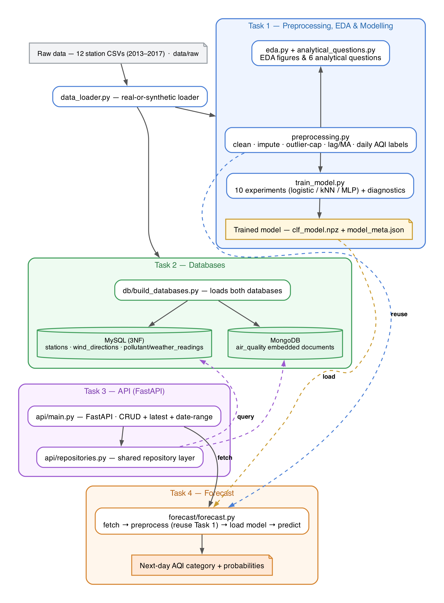

# Beijing Air-Quality Time-Series ML Pipeline


An end-to-end, reproducible machine-learning pipeline on the **Beijing Multi-Site
Air-Quality** dataset (Kaggle): 12 monitoring stations, hourly readings from
2013-03-01 to 2017-02-28, six pollutants and six meteorological variables
(420,768 station-hours). The model forecasts the **next day's** PM2.5 AQI category
across six US-EPA health bands (Good → Hazardous).

Built for *Formative 1: Building a Pipeline for Time-Series Data*, it covers all
four tasks end to end:

- **Task 1 — Preprocessing, EDA & modelling.** Time-aware per-station imputation,
  strictly causal lag/moving-average features, six analytical questions, and a
  tuned next-day AQI classifier (10 experiments across 3 model families).
- **Task 2 — Databases.** A 3NF MySQL schema (4 tables + ERD) and an embedded
  MongoDB collection, each demonstrated with real queries.
- **Task 3 — API.** A FastAPI service exposing full CRUD plus the required
  latest-record and date-range endpoints over **both** databases.
- **Task 4 — Forecast.** One script that fetches from the API, reuses the Task-1
  preprocessing, loads the trained model, and predicts the next day's category.

> [!NOTE]
> **Runs out of the box.** The real dataset is committed under `data/raw/`
> (12 station CSVs, ~32 MB), so every figure, table, and number in the report
> reproduces from a fresh clone with no downloads. If the raw CSVs are ever
> missing, `src/data_loader.py` regenerates an identical-schema synthetic
> stand-in automatically. All models are hand-written in NumPy, so there are no
> heavy ML dependencies.

## Architecture



Raw station CSVs → preprocessing & modelling (Task 1) → MySQL + MongoDB (Task 2)
→ a FastAPI service over both (Task 3) → a forecast script that fetches from the
API, reuses the Task-1 preprocessing, loads the trained model, and predicts the
next day's AQI category (Task 4). Diagram source: [`docs/pipeline_architecture.dot`](docs/pipeline_architecture.dot) (Graphviz).

## Contents

- [Architecture](#architecture)
- [Prerequisites](#prerequisites)
- [Quickstart](#quickstart)
- [Running each task individually](#running-each-task-individually)
- [Using the API](#using-the-api)
- [Run against real MySQL + MongoDB (Docker)](#run-against-real-mysql--mongodb-docker)
- [Repository structure](#repository-structure)
- [Results](#results-task-1c-next-day-aqi-category-classification)
- [How it works](#how-it-works)
- [Deliverables](#deliverables)
- [Team (Group 8)](#team-group-8)
- [Data source](#data-source)

## Prerequisites

- **Python 3.10+** (developed and tested on 3.12).
- **pip**. A virtual environment is recommended.
- **Docker** — *optional*, only for the real MySQL 8 + MongoDB 7 path. The full
  pipeline runs without it (SQLite mirror + in-memory MongoDB).

## Quickstart

```bash
# 1. clone
git clone https://github.com/supserrr/beijing-aqi-pipeline.git
cd beijing-aqi-pipeline

# 2. (recommended) create a virtual environment
python -m venv .venv && source .venv/bin/activate   # Windows: .venv\Scripts\activate

# 3. install dependencies
pip install -r requirements.txt

# 4. run the ENTIRE pipeline (Tasks 1-4) with one command
python run_all.py
```

`run_all.py` runs every stage in order and is idempotent — rerun it any time:

| Step | Script | Produces |
|------|--------|----------|
| Task 1A | `src/eda.py` | EDA figures + `outputs/tables/eda_summary.json` |
| Task 1B | `src/analytical_questions.py` | 6 question figures + interpretations |
| Task 1C | `src/train_model.py` | 10-experiment table, diagnostics, trained model |
| Task 2  | `db/build_databases.py` | `sql_query_results.md`, `mongo_query_results.md` |
| Task 3  | `api/demo_crud.py` | `api_crud_demo.md` (every endpoint, both DBs) |
| Task 4  | `forecast/forecast.py` | `forecast_demo.md` + backtest figure |

> [!TIP]
> All artefacts land in `outputs/figures/` and `outputs/tables/`; the trained
> model and its metadata go to `models/`. These are committed, so you can inspect
> the expected results before running anything.

## Running each task individually

```bash
# ---- Task 1: EDA, analytical questions, model ----
python src/eda.py                    # -> outputs/figures + eda_summary.json
python src/analytical_questions.py   # -> 6 question figures + interpretations
python src/train_model.py            # -> 10-experiment table + diagnostics + model

# ---- Task 2: build both databases + run all queries ----
python db/build_databases.py         # -> sql_query_results.md, mongo_query_results.md
#   Uses a SQLite mirror of the canonical MySQL schema (sql/schema_mysql.sql)
#   plus an in-memory MongoDB, so it runs with no database servers.

# ---- Task 3: exercise every API endpoint offline (both backends) ----
python api/demo_crud.py

# ---- Task 4: forecast the next day's AQI category ----
python forecast/forecast.py --station Aotizhongxin
```

## Using the API

Serve the FastAPI app (installs a few extra packages for the live server):

```bash
pip install fastapi uvicorn pymysql pymongo
uvicorn api.main:app --reload        # interactive docs at http://localhost:8000/docs
```

Every operation is available for both backends — use `sql` or `mongo` as the
`{db}` segment:

| Method & path | Operation |
|---|---|
| `POST /{db}/readings` | Create a reading |
| `GET /{db}/readings/{station}/latest` | Latest record *(required)* |
| `GET /{db}/readings/{station}/range?start=…&end=…` | Records by date range *(required)* |
| `GET /{db}/readings/{station}/item/{ts}` | Read one record |
| `PUT /{db}/readings/{station}/item/{ts}` | Update a record |
| `DELETE /{db}/readings/{station}/item/{ts}` | Delete a record |

Example requests against the SQL backend:

```bash
# latest record for a station
curl "http://localhost:8000/sql/readings/Aotizhongxin/latest"

# records in a datetime window
curl "http://localhost:8000/sql/readings/Aotizhongxin/range?start=2017-02-28T18:00:00&end=2017-02-28T23:00:00"

# create, update, delete
curl -X POST "http://localhost:8000/sql/readings" -H "Content-Type: application/json" \
  -d '{"station":"Aotizhongxin","ts":"2017-03-01T00:00:00","pm2_5":123,"pm10":180,"so2":12,"no2":64,"co":900,"o3":30}'
curl -X PUT  "http://localhost:8000/sql/readings/Aotizhongxin/item/2017-03-01T00:00:00" \
  -H "Content-Type: application/json" -d '{"pm2_5":999}'
curl -X DELETE "http://localhost:8000/sql/readings/Aotizhongxin/item/2017-03-01T00:00:00"
```

Swap `sql` for `mongo` to hit the MongoDB backend (its `POST` body embeds
`pollutants`/`weather` sub-documents; see `/docs`). Point the forecast script at
the live API with:

```bash
API_URL=http://localhost:8000 python forecast/forecast.py --station Aotizhongxin
```

## Run against real MySQL + MongoDB (Docker)

The commands above need no servers. To exercise the **canonical** MySQL 8 +
MongoDB 7 implementation, use Docker:

```bash
docker compose up --build
```

This starts MySQL 8 and MongoDB 7, creates the schema from
`sql/schema_mysql.sql`, loads the data into both via `db/load_to_servers.py`, and
serves the API at http://localhost:8000/docs. Then, for example:

```bash
# live forecast against the running API
API_URL=http://localhost:8000 python forecast/forecast.py --station Aotizhongxin

# query MySQL directly
docker compose exec mysql mysql -uroot -pbeijing beijing_air \
  -e "SELECT s.station_name, MAX(p.ts) FROM pollutant_readings p \
      JOIN stations s USING(station_id) GROUP BY s.station_name;"
```

> [!TIP]
> `SAMPLE_MONTHS=6 docker compose up --build` loads only the last 6 months for a
> quick demo. `docker compose down -v` stops everything and wipes the DB volumes.

## Repository structure

```
beijing-aqi-pipeline/
├── data/raw/                 # real Beijing dataset: 12 station CSVs (2013-2017) + note
├── src/                      # Task 1: preprocessing, EDA, modelling
│   ├── generate_synthetic.py #   faithful synthetic fixture generator
│   ├── data_loader.py        #   real-or-synthetic loader (real wins)
│   ├── preprocessing.py      #   clean · impute · cap · lag/MA features · daily AQI-class builder
│   ├── eda.py                #   1A: EDA figures + summary
│   ├── analytical_questions.py #  1B: 6 questions (2 use lag/MA)
│   └── train_model.py        #   1C: next-day AQI classification — logistic/kNN/MLP (10 experiments) + diagnostics
├── sql/                      # Task 2: relational design
│   ├── schema_mysql.sql      #   MySQL DDL (3NF, 4 tables)
│   ├── queries_mysql.sql     #   5 demo queries (incl. latest + date range)
│   └── erd.eraser            #   ERD source -> outputs/figures/erd.png (erd.dot / erd.mermaid are alt sources)
├── mongo/                    # Task 2: document design
│   ├── collection_design.md  #   embedded-document design + indexes
│   └── sample_documents.json
├── db/                       # Task 2: database build + load
│   ├── build_databases.py    #   builds both DBs offline (SQLite mirror + mongomock), runs queries, saves results
│   └── load_to_servers.py    #   loads real MySQL 8 + MongoDB 7 (the docker-compose loader)
├── api/                      # Task 3: FastAPI service
│   ├── repositories.py       #   shared, framework-free CRUD/query logic
│   ├── main.py               #   FastAPI app (MySQL + MongoDB)
│   └── demo_crud.py          #   offline demo of every endpoint (both DBs)
├── forecast/forecast.py      # Task 4: fetch -> preprocess -> load model -> predict
├── models/                   # trained model + metadata
├── outputs/figures|tables/   # all generated figures + result tables
├── docker-compose.yml        # MySQL + MongoDB + loader + API (one command)
├── Dockerfile
├── run_all.py                # reproduce the entire pipeline end-to-end
└── requirements.txt
```

## Results (Task 1C: next-day AQI-category classification)

The task is to predict the **next day's** PM2.5 AQI category (six EPA bands,
Good → Hazardous), pooling all 12 stations into ~17,500 station-days. The split is
strictly temporal by date (70/15/15), tuned on the validation window and scored
once on the held-out test window. Ten experiments span three model families plus
two baselines (full table with per-run notes in
[`outputs/tables/experiment_table.md`](outputs/tables/experiment_table.md)).

| Experiment | Hyper-params | test acc | macro-F1 |
|---|---|---|---|
| Persistence (today's category) | none | 0.38 | 0.34 |
| Majority class | always 'Unhealthy' | 0.35 | 0.09 |
| Logistic regression (lags only) | 5 features | 0.42 | 0.22 |
| Logistic regression (full) | 29 features | 0.48 | 0.28 |
| Logistic regression (tuned L2) | L2 = 1e-3 | 0.49 | 0.30 |
| k-NN classifier (tuned) | k = 15 | 0.38 | 0.31 |
| **MLP classifier (best acc, deployed)** | **h = 8, lr = 0.1, L2 = 1e-4** | **0.49** | 0.33 |
| Logistic (class-balanced) | L2 = 1e-3, β = 0.75 | 0.40 | **0.36** |

Every learned model except k-NN beats the 0.38 persistence baseline. The deployed
forecaster is a from-scratch MLP with the best test accuracy (≈ 0.49,
macro-AUC ≈ 0.77); a class-balanced logistic model reaches the best macro-F1
(≈ 0.36) by recovering minority-class recall, at an accuracy cost. Adding same-day
co-pollutants and the weekly-MA deviation lifts the linear models from ≈ 0.46 to
≈ 0.49 accuracy, while k-NN over-fits (train ≈ 0.76 / test ≈ 0.38). The confusion
matrix, ROC and precision-recall curves (`outputs/figures/clf_*.png`) show the
model is strong on the common bands but weaker on the rarer categories, limited by
class imbalance. The forecast script predicts the next day's category with class
probabilities and backtests over the recent window.

## How it works

- **Leakage-safe features.** The hourly series is aggregated to per-station daily
  means and labelled with the **next** day's EPA AQI category. Features are
  strictly causal — daily PM2.5 lags {today, 1, 2, 3, 7}, 7/30-day rolling
  mean & std, the deviation of today's PM2.5 from its weekly mean, same-day
  co-pollutants (PM10/SO2/NO2/CO/O3, with 1-day lags of PM10/NO2/CO), same-day
  weather, and the (known) calendar of the target day — so no future information
  leaks in. Imputation runs per station before feature construction, and a
  conservative per-station Tukey fence (Q3 + 3·IQR) caps extreme spikes
  (< 1% of readings).
- **Modelling.** Three families — multinomial logistic regression (incl. a
  class-balanced variant), instance-based k-NN, and a from-scratch MLP — are
  compared against persistence and majority-class baselines, judged on macro-F1 as
  well as accuracy, with confusion-matrix, ROC/AUC, precision-recall and
  bias–variance diagnostics. All are implemented in pure NumPy.
- **Databases.** The relational schema is 3NF, with two dimension tables
  (`stations`, `wind_directions`) and two fact tables sharing the
  `(station_id, ts)` grain. MongoDB embeds one document per station-hour for
  single-lookup reads. Both are queried with real results in `outputs/tables/`.
  The SQL demo runs over the full dataset (420,768 rows); the offline MongoDB demo
  uses the most recent 4-month window (~35,400 docs) to stay lightweight, so its
  aggregate counts reflect that heating-season window.
- **Shared repository layer.** SQL and Mongo CRUD share one framework-free
  repository (`api/repositories.py`). The SQL repo is placeholder-parameterised
  (`%s` for MySQL, `?` for SQLite) and executes through a cursor, so the identical
  logic runs against real MySQL and the offline SQLite mirror alike.

## Deliverables

- **Report** — `Formative1_Report.pdf`, submitted alongside this repository. It
  documents all four tasks with a literature review, methodology, results,
  discussion, and references.
- **Databases** — `sql/schema_mysql.sql`, `mongo/collection_design.md`, and the
  query results in `outputs/tables/`.
- **API** — `api/main.py` (FastAPI) plus the `api/demo_crud.py` transcript.
- **Forecast** — `forecast/forecast.py`.

## Team (Group 8)

Each of the four members owned one of the assignment's four tasks end to end.

| Member | Task owned |
|---|---|
| **Gaju Keane** | Task 1: preprocessing, EDA, analytical questions, and the next-day AQI classification model (tuning & diagnostics) |
| **Joella Teta** | Task 2: relational (MySQL) + MongoDB schema design, ERD, and the demonstration queries |
| **Serein Byiringiro Shima** | Task 3: FastAPI CRUD + time-series query endpoints for both databases |
| **Parfait Christian Henry UHIRIWE** | Task 4: consolidated next-day forecast script, plus repository setup and reproducibility |

Shared: dataset selection, repository structure, literature review, report, and integration.
A task-allocation and participation tracker (with the meeting log) is available
[here](https://docs.google.com/spreadsheets/d/1Ts2DZW2LTbtAyxYOyiHGMz8Riltqh_vwTHcGrhUE0PM/edit?usp=sharing).

## Data source

Beijing Multi-Site Air-Quality Data, from Kaggle:
<https://www.kaggle.com/datasets/sid321axn/beijing-multisite-airquality-data-set>
